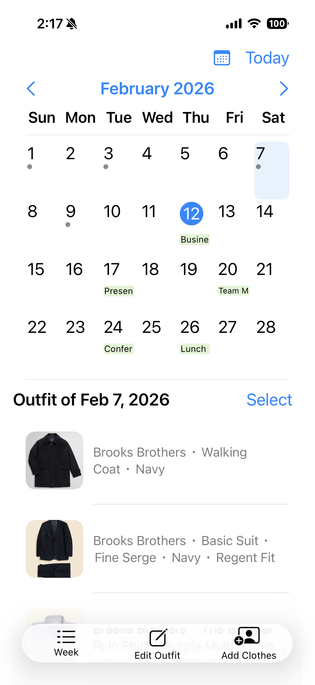
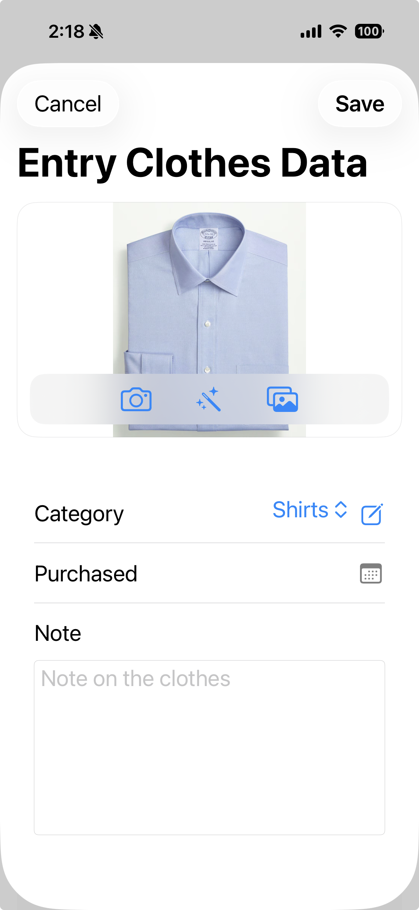
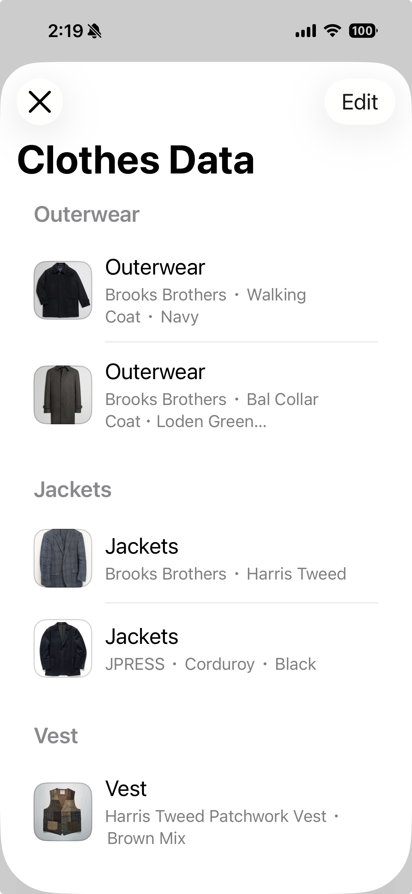
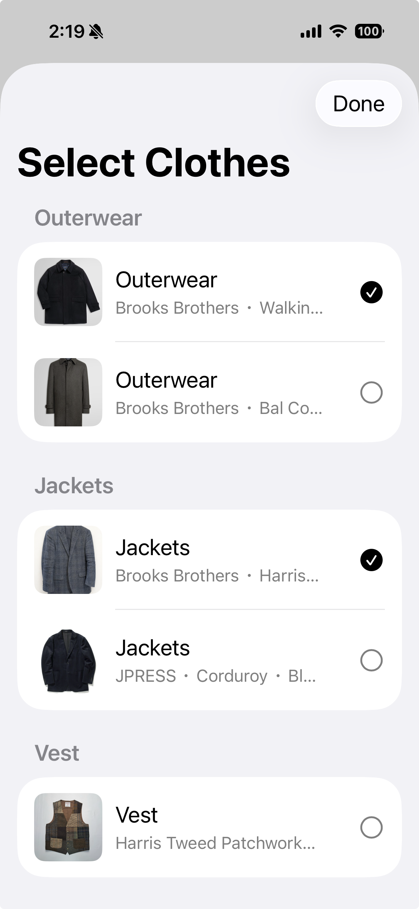
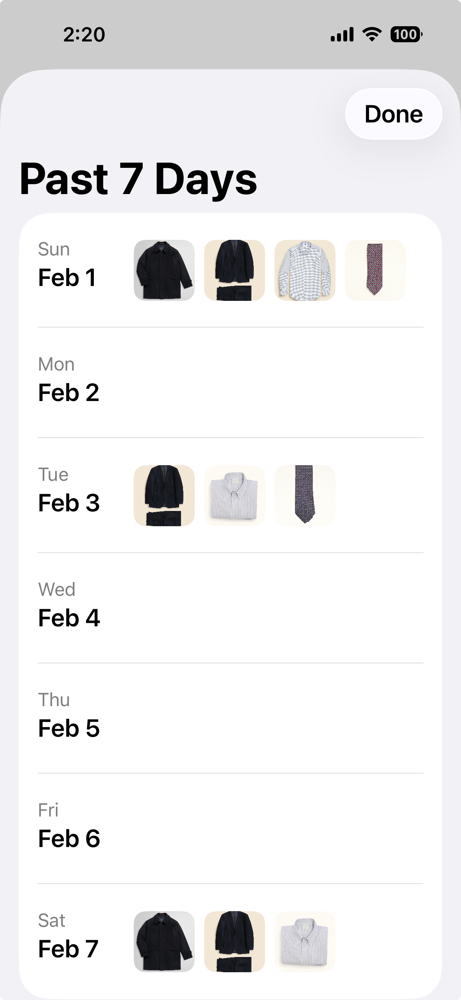

# clothing-diary
A simple outfit tracking app for iPhone and iPad.

## Screenshots

### Calendar View

  

The main screen of Clothing Diary.  
You can see your outfit history at a glance and quickly access weekly summaries or editing tools.

### Add Clothes

  

Register new clothes with photo, category, purchase date, and notes.

### Edit Clothes

  

Update existing items and manage your wardrobe easily.

### Select Outfit

  

Choose clothes for the selected date directly from your wardrobe.

### Weekly View

  

Review your outfits for the week in a clean list format.

## Features
-  Calendar integration  
  Events from your selected calendar are displayed directly on the calendar screen.
-  Camera support  
  Take photos of your clothes and automatically adjust the background.
-  Custom categories  
  Create and manage your own clothing categories.
-  iCloud sync  
  Your wardrobe stays consistent across devices.

## How to Use
1. Tap **Add Clothes** to register new items.
2. Select a date on the calendar.
3. Choose your outfit for the day.
4. Review your weekly outfit history anytime.
